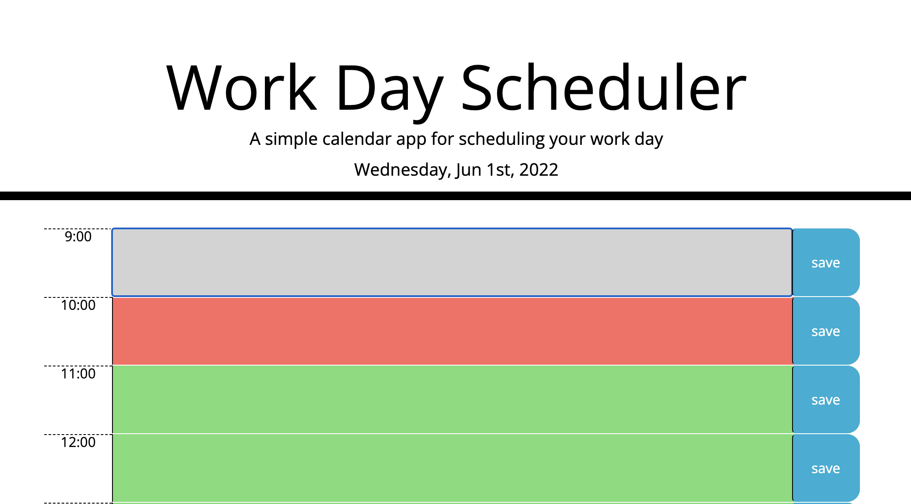

# Module 5 Work Day Scheduler

## Website Description
This is a calendar application that allows a user to save events for each hour of the day. Past events are in grey, present hour events in red, and future events that have not yet come to pass are in green. The events are organized chronologically throughout the present day, which is displayed at the top. 

## Challenge Description

The calendar application features dynamically updated HTML and CSS powered by jQuery. Starter code was provided which used Moment.js, a library to work with date and time. The date and day dynamically changes via this library. Row divs are created in the javascript file to include time, the event's information, and a save button for local storage. Text can be inputted and saved. Different classes, which stylizes colors, are assigned for which hour has occurred whether less than, equal to, or greater than the present hour in a function. An array is used to populate the time slots. 

## User Story

```
AS AN employee with a busy schedule
I WANT to add important events to a daily planner
SO THAT I can manage my time effectively
```

## Acceptance Criteria

```
GIVEN I am using a daily planner to create a schedule
WHEN I open the planner
THEN the current day is displayed at the top of the calendar
WHEN I scroll down
THEN I am presented with time blocks for standard business hours
WHEN I view the time blocks for that day
THEN each time block is color-coded to indicate whether it is in the past, present, or future
WHEN I click into a time block
THEN I can enter an event
WHEN I click the save button for that time block
THEN the text for that event is saved in local storage
WHEN I refresh the page
THEN the saved events persist
```

## Tasks Completed
The HTML document includes:
* a proper title and SEO metadata

The CSS document includes:
* 

The JavaScript document includes:
* 

## Languages
- HTML
- CSS
- JavaScript
- JQuery

## Links
* [Deployed webpage](https://villettec.github.io/Module_5-Work_Day_Scheduler/)

* [Repository](https://github.com/villettec/Module_5-Work_Day_Scheduler)

## Screenshot


## Credit
Villette Comfort

villette@live.com